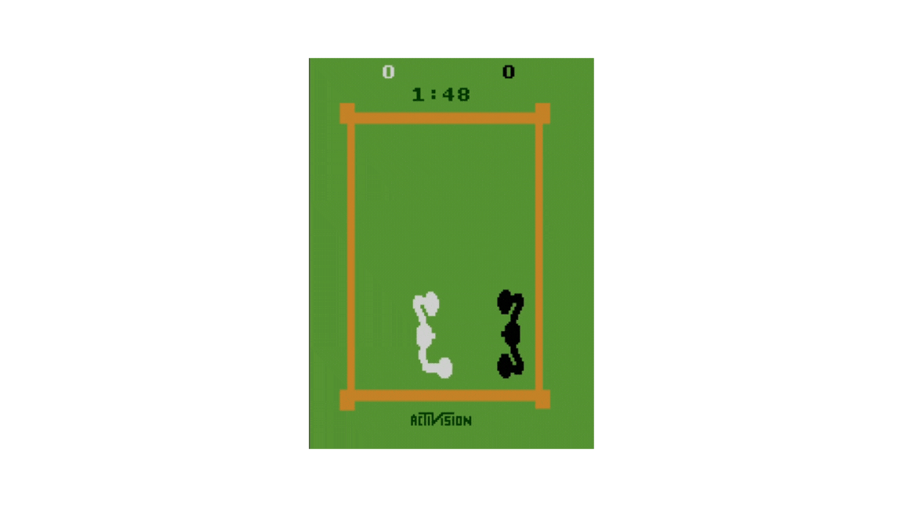

# Atari Boxing Project

This repository implements a **multi-agent reinforcement learning system** for the Atari Boxing environment. The goal of this project is to create two intelligent agents that compete against each other in the boxing game, learn from their interactions, and improve their performance over time. The agents are trained using **deep Q-learning** and work in parallel to ensure dynamic and competitive gameplay.

---

## 📜 Table of Contents

- [Features](#-features)
- [Directory Structure](#-directory-structure)
- [Installation](#️-installation)
- [Usage](#-usage)
- [Technical Details](#️-technical-details)
- [Results](#-results)
- [Future Work](#-future-work)
---

## 🌟 Features

- **Multi-Agent System**: Two agents trained simultaneously in a competitive environment.
- **Deep Q-Learning**: Uses convolutional neural networks (CNNs) to process game frames and predict actions.
- **Replay Buffer**: Stores past experiences for efficient training and stability.
- **Environment Wrapper**: Simplifies interaction with the PettingZoo Atari Boxing environment.
- **Dynamic Exploration**: Implements epsilon-greedy exploration with adaptive decay.
- **Evaluation Pipeline**: Robust tools to evaluate agent performance and visualize results.
- **Checkpointing**: Save and load models to resume training or evaluation.

---

## 📁 Directory Structure

```
AtariBoxingProject/
├── agents/
│   ├── __init__.py         # Initializes the agents package
│   ├── agent.py            # DQNAgent class for single-agent functionality
│   ├── multi_agent.py      # Multi-agent logic for training two agents
├── checkpoints/            # Directory for saving and loading model checkpoints
├── env_setup/
│   ├── __init__.py         # Initializes the environment setup package
│   ├── env_wrapper.py      # Wrapper for PettingZoo Atari environment
│   ├── utils.py            # Helper functions for environment setup
├── models/
│   ├── __init__.py         # Initializes the models package
│   ├── cnn_model.py        # CNN architecture for feature extraction
├── roms/                   # Contains the game ROM (Atari Boxing files)
├── training/
│   ├── __init__.py         # Initializes the training package
│   ├── evaluation.py       # Evaluates trained agents' performance
│   ├── replay_buffer.py    # Experience replay buffer implementation
│   ├── train.py            # Training script for the multi-agent system
│   ├── utils.py            # Helper functions for the training process
├── config.yaml             # Configuration file for hyperparameters
├── main.py                 # Entry point for running the project
├── README.md               # Project documentation
├── requirements.txt        # Python dependencies
├── test.py                 # Unit tests for components
```

---

## 🛠️ Installation

1. **Clone the Repository**
   ```bash
   git clone https://github.com/your-username/AtariBoxingProject.git
   cd AtariBoxingProject
   ```

2. **Install Dependencies**
   Use the `requirements.txt` file to install dependencies:
   ```bash
   pip install -r requirements.txt
   ```

3. **Add ROMs**
   Place the necessary Atari Boxing ROM files in the `roms/` directory.

4. **Configure Hyperparameters**
   Edit `config.yaml` to customize parameters like:
   - Learning rate
   - Discount factor
   - Epsilon decay

> **Note:**  
> The PettingZoo Atari Boxing environment is only available for **Mac/Linux/Unix systems**. Windows systems will not support this package.

---

## 🚀 Usage

### Training the Agents
To train the agents:
```bash
python training/train.py
```
This script initializes the environment, trains the agents, and saves checkpoints periodically.

### Evaluating the Agents
To evaluate performance after training:
```bash
python training/evaluation.py
```
This runs the trained agents against each other and logs their performance.

### Running the Game
Launch the trained agents in the Atari Boxing environment:
```bash
python main.py
```
Observe the agents' strategies and gameplay.

### Running Tests
Run unit tests to ensure code functionality:
```bash
python test.py
```

### Running `main.py` with Arguments
The `main.py` script supports the following arguments:
- `--mode`: Select `train` or `evaluate` (default: `train`).
- `--num_episodes`: Number of episodes for training (default: `0`).
- `--batch_size`: Batch size for training (default: `32`).
- `--target_update_freq`: Frequency of target network updates in episodes (default: `10`).
- `--gamma`: Discount factor for Q-learning (default: `0.99`).
- `--num_eval_games`: Number of games to play during evaluation (default: `10`).
- `--checkpoint_dir`: Directory to save or load model checkpoints (default: `checkpoints`).

Example commands:
- To train:
  ```bash
  python main.py --mode train --num_episodes 1000 --batch_size 64
  ```
- To evaluate:
  ```bash
  python main.py --mode evaluate --num_eval_games 20
  ```

> **Note for Linux/Unix Users:**  
> By default, the code is configured for Mac systems. To run on Linux/Unix systems, modify the environment initialization code in the following files:  
> - `multi_agent.py`  
> - `cnn_model.py`  
> - `train.py`  
> - `evaluation.py`  

Replace:
```python
env = boxing_v2.env(render_mode="human")
```
with:
```python
env = boxing_v2.env(render_mode="human", auto_rom_install_path="roms")
```

---

## ⚙️ Technical Details

### 1. **Multi-Agent Reinforcement Learning**
The project uses a multi-agent version of DQN where each agent is represented by a CNN and trains independently while competing in the shared environment.

### 2. **CNN Architecture**
The CNN processes game frames and extracts features. The architecture includes:
- 3 convolutional layers for feature extraction.
- Fully connected layers for decision-making.
- Rectified Linear Unit (ReLU) activation for non-linearity.

### 3. **Replay Buffer**
Stores past experiences (`state`, `action`, `reward`, `next_state`) and samples mini-batches for training to ensure better convergence.

### 4. **Environment Wrapper**
Simplifies interaction with the PettingZoo environment by:
- Normalizing observations.
- Stacking consecutive frames for temporal awareness.

---

## 📊 Results

- **Training Progress**: Agents progressively learn strategies to maximize their scores.
- **Competitive Dynamics**: Both agents adapt to each other's strategies, leading to engaging matches.
- **Model Performance**: The agents demonstrate high accuracy in predicting optimal actions after sufficient training.

**Sample Training Log**:
| Metric           | Value{white_agent,black_agent} |
|------------------|----------|
| Episodes Trained | 1000     |
| Average WinRates | {0.3521,0.6749} |
| Final Epsilon    | 0.01     |
| Average Reward   | {-1.7,1.7}     |

---

## 🛠️ Future Work

- Implement advanced algorithms like Proximal Policy Optimization (PPO).
- Extend to cooperative multi-agent environments.
- Add visualization tools for real-time performance tracking.

---
